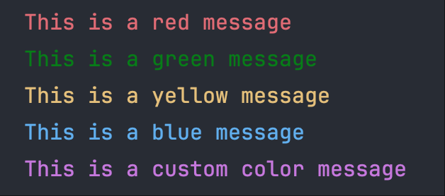

# Wauo - Python 工具大全

🚀 一个功能强大且易于使用的 Python 工具库，集成了爬虫、装饰器、线程池、数据库操作等实用功能。

## ✨ 核心特性

- **🕷️ 爬虫模块** - 简化的 HTTP 请求、响应处理和数据提取
- **🔧 装饰器集合** - 类型强校验、函数计时、错误处理等
- **⚡ 线程池管理** - 内存安全的线程池，自动防溢出
- **🗄️ 数据库支持** - 快速操作 MySQL 和 PostgreSQL
- **🎨 彩色输出** - 美观的终端颜色输出
- **📦 工具函数** - 多层字典取值、时间戳转换等实用工具

## 📋 系统要求

- Python 3.10 或更高版本
- 依赖包：requests, parsel, fake_useragent, loguru, pymysql, psycopg2, dbutils

## 🔧 安装

### 使用 pip（推荐）

```bash
pip install wauo -U
```

### 升级到最新版本

```bash
pip install --upgrade wauo
```

## 📚 使用指南

### 1️⃣ 爬虫模块

#### 基础请求

```python
from wauo import WauoSpider

spider = WauoSpider()

# GET 请求（默认）
url = 'https://github.com/markadc'
resp = spider.send(url)
print(resp.text)
```

#### POST 请求

```python
from wauo import WauoSpider

spider = WauoSpider()

api = 'https://api.example.com/endpoint'
payload = {
    'key1': 'value1',
    'key2': 'value2'
}

# 方式1：使用 data 参数
resp = spider.send(api, data=payload)

# 方式2：使用 json 参数
resp = spider.send(api, json=payload)
```

#### 响应处理

```python
from wauo import WauoSpider

spider = WauoSpider()
resp = spider.send("https://www.baidu.com")

# XPath 选择器
title = resp.get_one("//title/text()")
print(title)  # 输出：百度一下，你就知道

# 获取所有匹配项
links = resp.get_all("//a/@href")
```

#### 响应验证

**检查状态码**

```python
resp = spider.send('https://github.com/markadc')
# 如果响应码不在指定范围内则引发异常
resp.raise_for_status(codes=[200, 301, 302])
```

**检查响应内容**

```python
def is_valid_response(html: str) -> bool:
    """验证响应是否包含验证码"""
    return html.find('验证') == -1

resp = spider.send('https://wenku.baidu.com/wkvcode.html')
# 如果 is_valid_response 返回 False 则引发异常
resp.raise_for_text(validate=is_valid_response)
```

#### 设置默认请求头

```python
from wauo import WauoSpider

# 为所有请求设置默认 Cookie
cookie = 'Your Cookies Here'
spider = WauoSpider(default_headers={'Cookie': cookie})

resp1 = spider.send('https://github.com/markadc')
resp2 = spider.send('https://github.com/markadc/wauo')

# 两个请求都会自动携带 Cookie
print(resp1.request.headers)
print(resp2.request.headers)
```

### 2️⃣ 数据库模块

#### PostgreSQL 数据库操作

```python
from wauo.db import PostgresqlClient

# 配置数据库连接
psql_cfg = {
    "host": "localhost",
    "port": 5432,
    "db": "test",
    "user": "wauo",
    "password": "admin1",
}

# 创建客户端并连接
psql = PostgresqlClient(**psql_cfg)
psql.connect()

tname = 'users'

# 删除表（如果存在）
psql.drop_table(tname)

# 创建表
psql.create_table(tname, ['name', 'age'])

# 创建高级表（自动添加 id、created_at、updated_at）
# 使用 create_great_table 创建带时间追踪的表
psql.create_great_table('products', ['name', 'price', 'stock'])
# 自动包含：
# - id: 自增主键
# - created_at: 新增数据时自动记录创建时间（不为NULL）
# - updated_at: 修改数据时自动更新时间（初始为NULL，修改后才有值）

# 时间追踪示例
psql.insert_one('products', {'name': 'iPhone', 'price': '5999', 'stock': '100'})
# 查询结果：id=1, created_at='2025-10-30 10:00:00', updated_at=NULL

psql.update('products', {'price': '4999'}, "id = %s", (1,))
# 查询结果：id=1, created_at='2025-10-30 10:00:00', updated_at='2025-10-30 11:30:00'
# 通过 updated_at 可以判断数据是否被修改过！

# 插入单条数据
n = psql.insert_one(tname, {'name': 'Alice', 'age': 30})
print(f"插入行数: {n}")

# 批量插入数据
psql.insert_many(tname, [
    {'name': 'Bob', 'age': 25},
    {'name': 'Charlie', 'age': 35}
])

# 查询所有数据
rows = psql.query(f"SELECT * FROM {tname}")
for row in rows:
    print(dict(row))

# 更新数据
n = psql.update(tname, {'age': 31}, "name = %s", ('Alice',))
print(f"更新行数: {n}")

# 删除数据
n = psql.delete(tname, "name = %s", ('Bob',))
print(f"删除行数: {n}")

# 关闭连接
psql.close()
```

#### MySQL 数据库操作

```python
from wauo.db import MysqlClient

# 配置类似 PostgreSQL
mysql_cfg = {
    "host": "localhost",
    "port": 3306,
    "db": "test",
    "user": "root",
    "password": "password",
}

mysql = MysqlClient(**mysql_cfg)
mysql.connect()

# 使用方法与 PostgreSQL 相同
# ...
```

### 3️⃣ 工具函数

#### 彩色输出

```python
from wauo.printer import Printer

p = Printer()
p.red("这是红色消息")
p.green("这是绿色消息")
p.yellow("这是黄色消息")
p.blue("这是蓝色消息")
p.output("自定义颜色消息", "magenta")
```



#### 类型强校验装饰器

```python
from wauo.utils import type_check

@type_check
def add(x: int, y: int) -> int:
    """计算两个数的和"""
    return x + y

# ✅ 正确调用
result = add(1, 2)  # 返回 3

# ❌ 类型错误
try:
    add(1, "2")  # 引发异常：参数 'y' 应该是 <class 'int'> 而不是 <class 'str'>
except TypeError as e:
    print(f"错误: {e}")
```

#### 多层字典取值

```python
from wauo.utils import nget

data = {
    "user": {
        "info": {
            "profile": {
                "name": "张三",
                "age": 25
            }
        }
    }
}

# 安全地获取深层嵌套的值
name = nget(data, "user.info.profile.name")  # "张三"
age = nget(data, "user.info.profile.age")    # 25

# 键不存在时返回默认值
phone = nget(data, "user.info.contact.phone", failed="未提供")  # "未提供"

# 获取中间节点
profile = nget(data, "user.info.profile")
# {'name': '张三', 'age': 25}
```

### 4️⃣ 线程池管理

```python
from wauo.pool import PoolWait

def worker(task_id: int):
    """工作函数"""
    return f"Task {task_id} completed"

# 创建线程池管理器
pool = PoolWait(max_workers=10)

# 提交任务
for i in range(100):
    pool.submit(worker, i)

# 等待所有任务完成并获取结果
results = pool.get_results()
for result in results:
    print(result)
```

## 🔄 更新历史

- **v0.9.6** - 最新版本

  - ✨ PostgreSQL 新增 `create_great_table` 方法
    - 自动创建 id 主键（自增）
    - 自动添加 created_at 时间戳（新增时触发）
    - 自动添加 updated_at 时间戳（修改时触发）
    - 自动创建数据库触发器，实现时间字段自动更新

- **v0.9.5**

  - ✨ 新增 DB 模块，支持 MySQL 和 PostgreSQL 操作
  - ✨ 新增 `jsonp2json` 静态方法
  - ✨ 爬虫默认保持会话状态
  - ✨ 新增 `get_uuid` 和 base64 加解密静态方法
  - 🔄 优化 `send` 方法，增加 `delay` 参数支持
  - ✨ 新增 `update_default_headers` 方法
  - 📝 完善 `send` 方法注释

- **早期版本**
  - ✨ 添加装饰器函数集合
  - ✨ 线程池管理器支持上下文管理
  - ✨ `PoolWait` 和 `PoolMan` 线程池管理
  - ✨ 彩色输出（Printer）模块
  - 📝 多次参数优化和文档完善

## 📖 更多文档

关于每个模块的详细使用方法：

- [爬虫模块文档](docs/spiders.md)
- [数据库模块文档](docs/database.md)
- [线程池文档](docs/pool.md)
- [工具函数文档](docs/utils.md)

## 🤝 贡献

欢迎提交 Issue 和 Pull Request！

## 📄 许可证

MIT License

## 👤 作者

- **WangTuo** - [markadc@126.com](mailto:markadc@126.com)
- GitHub: [markadc/wauo](https://github.com/markadc/wauo)
